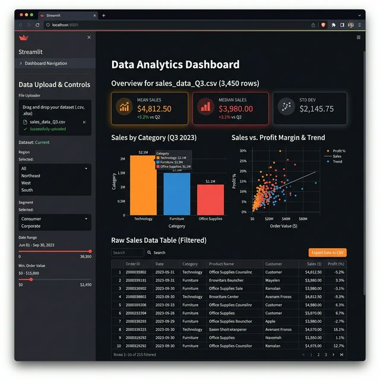

# Interactive Data Visualization App

A powerful analytical web application that allows non-technical users to upload raw CSVs and instantly generate interactive business charts and summary statistics.

✔ Eliminates the need for expensive BI tools or Data Analysts for day-to-day reporting
✔ Accelerates data discovery by auto-detecting data types and recommending the perfect visualizations
✔ Enables seamless collaboration by allowing executives to filter data dynamically and export clean results

## Use Cases
- **Sales Analytics:** Empower sales managers to upload quarterly CRM exports and instantly explore revenue correlations by region.
- **Financial Auditing:** Allow finance teams to quickly identify outliers in massive transaction logs using interactive box plots.
- **Client Presentations:** Present complex datasets to stakeholders with beautiful, interactive Plotly charts that respond to live questions.

## Setup

```bash
pip install -r requirements.txt

# Optional: generate the included sample dataset
python generate_sample.py

# Run
streamlit run app.py
```

Open: http://localhost:8501

## Usage

1. Upload a CSV from the sidebar (or click "Use sample dataset")
2. Inspect the **overview** — row count, null values, dtypes
3. Pick a **chart type** and configure axes
4. Use the **filter section** to narrow rows
5. Download filtered data with the export button

## Example — Sample Dataset Output

| Metric | Value |
|---|---|
| Rows | 200 |
| Columns | 7 |
| Numeric cols | 4 |
| Missing values | 0 |

Charts available: revenue histogram, revenue by region (bar), revenue vs orders (scatter), revenue over time (line), correlation heatmap.

## Tech Stack

`streamlit` · `pandas` · `plotly`

## Screenshot



